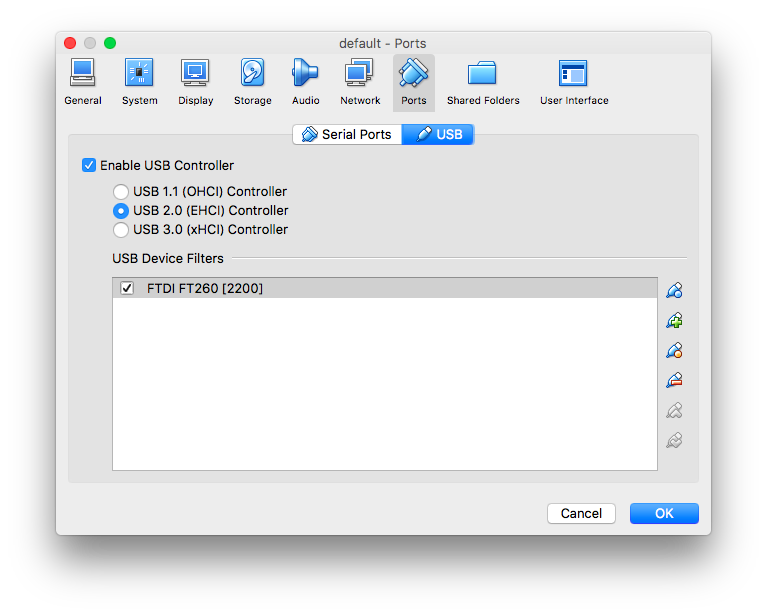
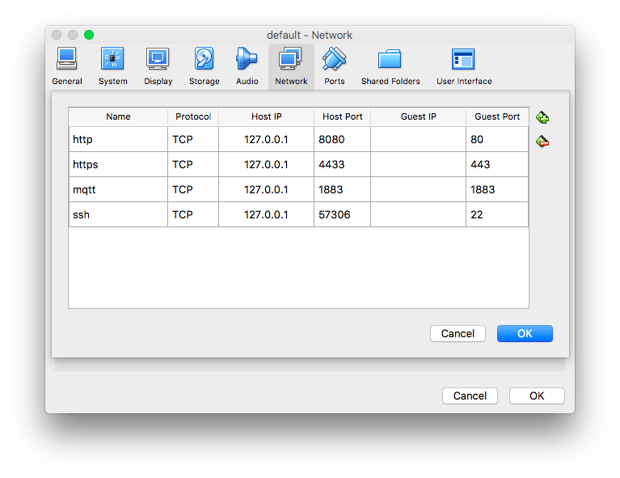

# BigClown Alpha - Software Setup for macOS Host Platform

## Prerequisites

- macOS 10.10.3 Yosemite or newer
- Mac must be a 2010 or newer model, with Intel’s hardware support for memory management unit (MMU) virtualization; i.e., Extended Page Tables (EPT)
- At least 4 GiB of RAM
- VirtualBox prior to version 4.3.30 must NOT be installed (it is incompatible with Docker for Mac)
- Internet connectivity
- USB cable, Bridge Module and sensors/actuators (Tags, Modules)

## Download and install DockerToolbox

[DockerToolbox-1.12.1.pkg](https://github.com/docker/toolbox/releases/download/v1.12.1/DockerToolbox-1.12.1.pkg)

Docker Toolbox 1.12.1 contains:

- Docker 1.12.1
- Boot2Docker ISO 1.12.1
- docker-machine 0.8.1
- docker-compose 1.8.0
- Kitematic 0.12.0
- Git version 2.9.0
- VirtualBox 5.1.4

## Download and install VirtualBox Extension Pack

Start **Docker Quickstart Terminal**

`docker-machine stop`

`exit`

[VirtualBox 5.1.4 Oracle VM VirtualBox Extension Pack](http://download.virtualbox.org/virtualbox/5.1.4/Oracle_VM_VirtualBox_Extension_Pack-5.1.4-110228.vbox-extpack)

Install by doubleclick.

## Configure VirtualBox USB and Network

Connect Bridge Module with USB cable.

Start **Oracle VM VirtualBox**

Add USB config for FT260 of default virtual machine

Add Network Port Forwarding in Adapter 1 (NAT) of **default** virtual machine for http, https, mqtt

**Important!** Due to system limitations, you have to map all ports under 1024 (80, 443) to upper port space (80 to 8080, 443 to 4433).

## Configure Docker

Start **Docker Quickstart Terminal**

Disconnect Bridge Module from USB.

Connect Bridge Module with USB cable.

`mkdir -v $HOME/hub`

Note created directory (looks like /Documents/hub) - "host directory" in references below.

## Run Clown.Hub software on macOS

BigClown uses Docker container technology for seamless software delivery.

Pull Docker image from Docker Hub and run the container in one command:

`docker run -d -p 8080:80 -p 4443:443 -p 1883:1883 --privileged -v /dev:/dev -v $HOME/hub:/var/hub -h hub-container --name hub clown/hub`

You can stop container by: 

`docker stop hub`

And start it again by: 

`docker start hub`

## Open the browser and play with the gadgets

Navigate to URL:

<https://hub.local:4433/app> or <https://localhost:4433/app>

Be aware, that self-signed autogenerated certificate is used at web server side, so you have to accept it in web browser (otherwise browser do not process content from web server over TLS).

Username: **clown**  
Password: **bigclown**  

## MQTT playground

Look at measured values (this will subscribe to messages from MQTT broker
running inside the container):

`docker exec hub mosquitto_sub -v -t 'nodes/bridge/0/#'`

Set relay to "true" state (this will publish message to MQTT broker
running inside the container):

`docker exec hub mosquitto_pub -t nodes/bridge/0/relay/i2c0-3b/set
 -m '{"state": true}'`

Set relay to "false" state:

`docker exec hub mosquitto_pub -t nodes/bridge/0/relay/i2c0-3b/set
 -m '{"state": false}'`

If you want to see values from a simulator (running as parallel process
inside the container):

`docker exec hub mosquitto_sub -v -t 'nodes/bridge/simulator/#'`
